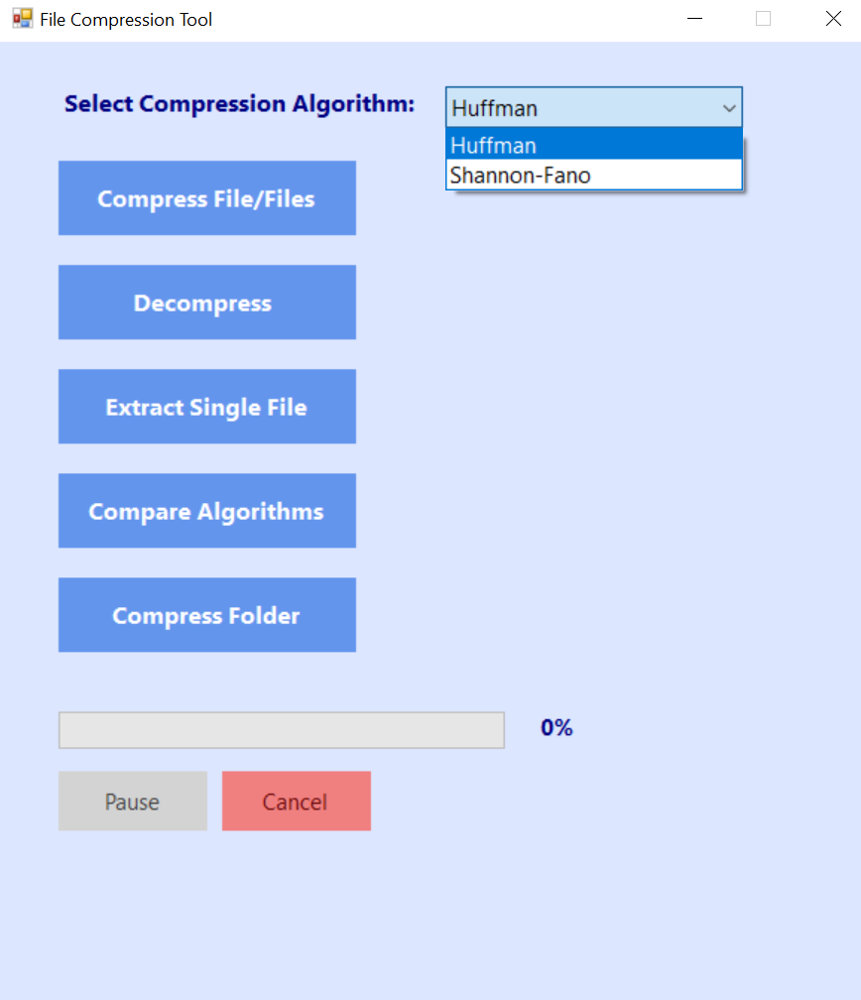
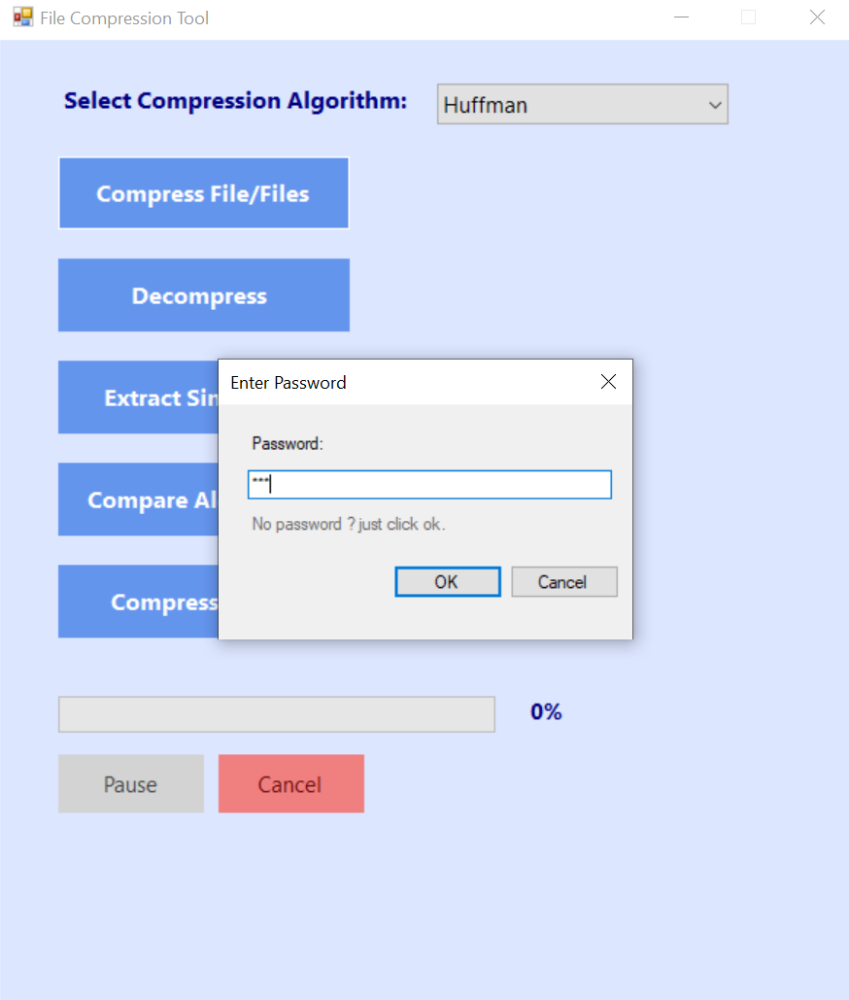
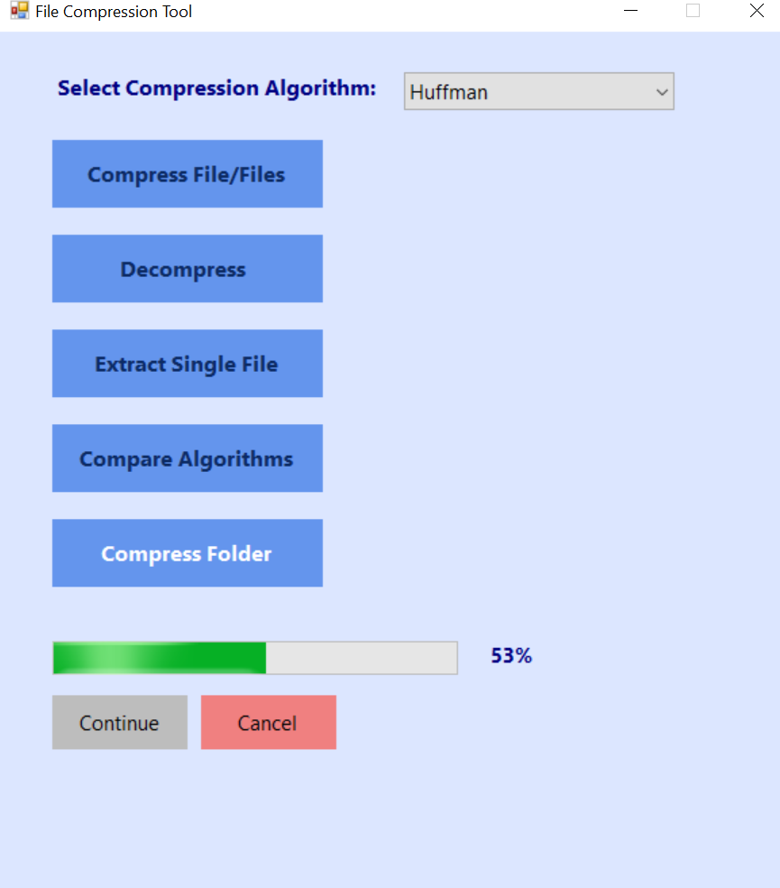

# 📁 File Compression Tool 🔗

## 🚀 Overview  
The **File Compression Tool** is a Windows Forms application developed in C# that allows users to compress and decompress files and folders using two lossless compression algorithms: **Huffman Coding** and **Shannon-Fano Coding**. The application supports encryption 🔒 for compressed files, progress tracking 📊, pause/resume ⏸️/▶️ functionality, and algorithm comparison ⚖️.

## 🌟 Features
- **🔧 Compression Algorithms**: Choose between Huffman and Shannon-Fano coding for compression.
- **🗂️ File and Folder Compression**: Compress single or multiple files, or entire folders.
- **🔐 Encryption**: Secure compressed files with AES encryption using a user-provided password.
- **🧾 Decompression**: Extract all files or a single file from an archive, with support for encrypted archives.
- **📈 Progress Tracking**: Visual progress bar and percentage display for compression/decompression tasks.
- **⏸️▶️ Pause/Resume and Cancel**: Pause or cancel ongoing operations.
- **⚔️ Algorithm Comparison**: Compare the performance (size and time) of Huffman and Shannon-Fano algorithms on selected files.
- **🙌 User-Friendly Interface**: Intuitive UI with clear controls and multilingual (Arabic/English) feedback.

## 🖼 Screenshots from the app

